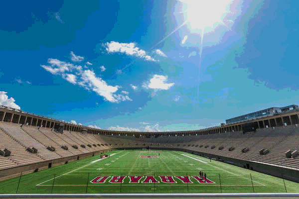
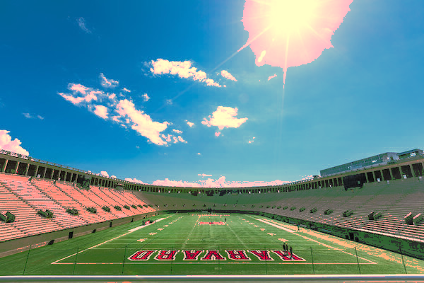

# Transform
A basic command-line image processing script for [bitmap](https://en.wikipedia.org/wiki/BMP_file_format) images written from scratch in C.

## Support
* Supports `BMP v3`, `BMP v4` and `BMP v5`.
* Supports `24-bit` and `32-bit` bitmap images.
* Does not support color palettes.
* Does not support compression.

## Usage 
```bash
./transform [options] <input file> <output file>
```
### Options:
* `-i` 

  Invert colors of image.
  ```bash
  ./transform sampleImages/marbles.bmp invert.bmp -i
  ```
  | Original | Inverted |
  |:--------:|:--------:|
  |  |  |
* `-l <factor>`

  Apply log gamma transform (natural log) with a multiplication `<factor>`.
  ```bash
  ./transform sampleImages/lightLarge.bmp log.bmp -l 30
  ```
  | Original | Log Gamma |
  |:--------:|:--------:|
  |  |  |
* `-e <factor>`

  Apply inverse log gamma transform (natural log) with a multiplication `<factor>`.
  ```bash
  ./transform sampleImages/lightLarge.bmp inverseLog.bmp -e 0.001
  ```
  | Original | Inverse Log Gamma |
  |:--------:|:--------:|
  |  |  |
* `-p <gamma>`

  Apply power-law gamma transform - RGB intensities are raised to the power `(1 / <gamma>)`.
  ```bash
  ./transform sampleImages/harvard.bmp gamma.bmp -p 2.0 
  ```
  | Original | Power-Law Gamma |
  |:--------:|:---------------:|
  |  |  |
  
  To apply the inverse gamma transform use `(1 / original gamma)` as `<gamma>` value.
 
  ```bash
  ./transform sampleImages/harvard.bmp inverseGamma.bmp -p 0.5
  ```
  | Original | Inverse Power-Law Gamma |
  |:--------:|:--------:|
  |  |  |
  
  **Example:** To get inverse of `<gamma> = 2.0` set `<gamma> = 0.5`
  ```bash
  ./transform sampleImages/harvard.bmp gamma.bmp -p 2.0 
  ./transform gamma.bmp retrieve.bmp -p 0.5 
  ```
  | Original | Power-Law Gamma | Inverse of Power-Law Gamma |
  |:--------:|:---------------:|:--------------------------:|
  |  |  |  |
  
  **Note:** We have significant [banding](https://en.wikipedia.org/wiki/Colour_banding) or loss of data in the highlights as the original image's hightights were already blown out.
  
  We can also do this in a single step:
  ```bash
  ./transform sampleImages/lightLarge.bmp retrieveLight.bmp -p 2.0 -p 0.5
  ```
  | Original | Retrieved |
  |:--------:|:---------:|
  |  |  |
* `-g`
  
  Convert image to `8-bit` [greyscale image](https://en.wikipedia.org/wiki/Grayscale).
  
  **Note:** Any options provided after this will be discarded.
  ```bash
  ./transform sampleImages/cat.bmp grey.bmp -g
  ```
  | Original | Greyscale |
  |:--------:|:--------:|
  |  |  |
* `-b`
  
  Bit plane slicing:
  
  Convert image to greyscale and generate 8 `1-bit` [monochrome images](https://en.wikipedia.org/wiki/Monochrome) representing each [bit plane](https://en.wikipedia.org/wiki/Bit_plane) ranging from MSB (Most Significant Bit) to LSB (Least Significant Bit) - [Bit numbering](https://en.wikipedia.org/wiki/Bit_numbering).
  
  **Note:** Any options provided after this will be discarded.
  ```bash
  ./transform sampleImages/lightLarge.bmp out.bmp -b
  ```
  | Original | Greyscale |
  |:--------:|:--------:|
  |  |  |
  
  | BitPlane 0 | BitPlane 1 | BitPlane 2 | BitPlane 3 |
  |:----------:|:----------:|:----------:|:----------:|
  |  |  |  |  |
  
  | BitPlane 4 | BitPlane 5 | BitPlane 6 | BitPlane 7 |
  |:----------:|:----------:|:----------:|:----------:|
  |  |  |  |  |
  
* `-s[=ATTR_LIST]`

  Set a range of RGB intensities to specified intensity.
  
  **Attributes:** `"Ra, Rb, Ri, Ga, Gb, Gi, Ba, Bb, Bi"`
  
  Intensities `a` to `b` are set to intensity `i`.
  ```bash
  ./transform sampleImages/harvard.bmp intensities.out -s150,255,255,50,100,100,200,255,200
  ```
  | Original | Intensities |
  |:--------:|:--------:|
  |  |  |
#### Note:
The order in which the options are provided are the order in which the transforms are applied.
